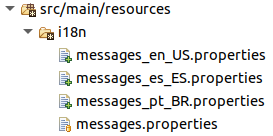
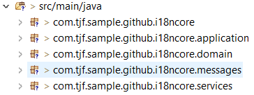

# Exemplo de uso do componente i18n Core

## Contexto

Para explicação do componente **i18n Core** vamos criar uma base de comunicação para um portão de pouso de naves.

## Começando com i18n Core

Para criação deste exemplo, vamos iniciar a explicação a partir de um projeto Spring já criado, caso você não possua um projeto criado basta acessar o [Spring initializr]([https://start.spring.io/](https://start.spring.io/)) e criar o projeto.

Para fácil entendimento do componente **i18n Core** vamos seguir a sequencia a baixo para criação do exemplo.

### Dependências

Para utilização do componente de tradução do TJF é necessário inserir a seguinte dependência em seu arquivo pom.xml.

```xml
<dependency>
    <groupId>com.totvs.tjf</groupId>
    <artifactId>tjf-i18n-core</artifactId>
    <version>{{version}}</version> <!-- Utilize a versão desejada -->
</dependency>
```
Em nosso exemplo iremos utilizar um arquivo JSON como base, para isso adicione a  seguinte dependência em seu arquivo pom.xml.

```xml
<dependency>
    <groupId>com.fasterxml.jackson.core</groupId>
    <artifactId>jackson-databind</artifactId>
</dependency>
```

### Criando as mensagens de tradução

Antes de iniciar o desenvolvimento vamos criar a estrutura de mensagens.

Para isso na pasta de **resources** do seu projeto crie uma pasta com o nome **i18n**. Após criar a estrutura de pastas, devemos criar os arquivos de mensagens abaixo da pasta messages, com os respectivos nome:

-  `messages.properties`: Este será o arquivo padrão de mensagens, para caso a tradução não for encontrada em outros arquivos.
-  `messages_pt_BR.properties`: Mensagens em português.
-  `messages_en_US.properties`: Mensagens em inglês.
-  `messages_es_ES.properties`: Mensagens em espanhol.



Com a estrutura criada, vamos inserir algumas mensagens padrões para o sistema. Para cada mensagem devemos informar um codigo de indentificação. Neste caso vamos criar duas mensagens. Edite o arquivo **messages.properties** e insira as seguintes linhas.

```
starship.authorized=Nave {0}, pouso autorizado
starship.destroyed=Nave {0}, pouso n\u00e3o autorizado
```

Após isso replique nos outros arquivos de mensagens e faça a tradução conforme o idioma definido no nome do arquivo, sem alterar o codigo da mensagem.

### Criando os arquivos de leituras
Para nosso exemplo iremos criar três arquivos JSON para leitura das informações, dessa forma crie na pasta de **resources** a uma pasta com o nome **json** e adicione os seguintes arquivos com seus respectivos conteúdos:

*Falcon.json*
```json
{
	"name": "Millennium Falcon",
	"model": "YT-1300 light freighter",
	"manufacturer": "Corellian Engineering Corporation",
	"cost_in_credits": "100000",
	"length": "34.37",
	"max_atmosphering_speed": "1050",
	"crew": "4",
	"passengers": "6",
	"cargo_capacity": "100000",
	"consumables": "2 months",
	"hyperdrive_rating": "0.5",
	"MGLT": "75",
	"starship_class": "Light freighter"
}
```

*Xwing.json*
```json
{
	"name": "X-wing",
	"model": "T-65 X-wing",
	"manufacturer": "Incom Corporation",
	"cost_in_credits": "149999",
	"length": "12.5",
	"max_atmosphering_speed": "1050",
	"crew": "1",
	"passengers": "0",
	"cargo_capacity": "110",
	"consumables": "1 week",
	"hyperdrive_rating": "1.0",
	"MGLT": "100",
	"starship_class": "Starfighter"
}
```

*Ywing.json*
```json
{
	"name": "Y-wing",
	"model": "BTL Y-wing",
	"manufacturer": "Koensayr Manufacturing",
	"cost_in_credits": "134999",
	"length": "14",
	"max_atmosphering_speed": "1000km",
	"crew": "2",
	"passengers": "0",
	"cargo_capacity": "110",
	"consumables": "1 week",
	"hyperdrive_rating": "1.0",
	"MGLT": "80",
	"starship_class": "assault starfighter"
}
```
Após finalizado teremos a seguinte estrutura:


### Criando o código fonte
Agora com as dependências do projeto prontas e a estrutura de Resources, vamos criar nossos códigos fontes.
Para isso vamos iniciar criando os pacotes do projeto, seguindo os seguintes nomes:
- com.tjf.sample.github.18ncore.application
- com.tjf.sample.github.18ncore.domain
- com.tjf.sample.github.18ncore.messages
- com.tjf.sample.github.18ncore.services

Onde no final teremos a seguinte estrutura:



>:heavy_exclamation_mark: Em nosso **SpringApplication** não iremos fazer alterações.

Iniciaremos pelo pacote de **domain**. Este pacote é responsável por conter as classes de domínio que serão criadas no projeto. No nosso exemplo, iremos criar apenas uma classe.

*Starship*
```java
package com.tjf.sample.github.i18ncore.domain;

public class Starship {

	private String name;
	private String model;
	private String manufacturer;
	private String cost;
	private String passengers;
	private String cargoCapacity;

	public Starship() {
	}

	//Adicione os getters e setters dos atributos
}
```

Com isso finalizamos nosso pacote **domain** e iremos para o pacote **services**. Este é responsável por conter os serviços do projeto. No nosso exemplo não criaremos um serviço, mas iremos ler nossos arquivos JSON criados na estrutura *resources/json*. Iremos criar apenas uma classe no pacote.

*StarshipService*

```java
package com.tjf.sample.github.i18ncore.services;

import java.io.File;
import java.io.IOException;
import java.nio.file.Files;
import org.springframework.beans.factory.annotation.Autowired;
import org.springframework.stereotype.Component;
import com.fasterxml.jackson.databind.ObjectMapper;
import com.tjf.sample.github.i18ncore.domain.Starship;

@Component
public class StarshipService {

	@Autowired
	ObjectMapper objectMapper;
	private Starship starship;
	public Starship getStarshipInfo(String shipInfo) throws IOException {

		ClassLoader classLoader = new StarshipService().getClass().getClassLoader();
		File file = new File(classLoader.getResource("json/" + shipInfo).getFile());

		String content = new String(Files.readAllBytes(file.toPath()));
		starship = objectMapper.readValue(content, Starship.class);
		return starship;
	}
}
```

Dessa forma finalizamos nosso pacote **services** e iremos para o pacote **messages** neste pacote devem ficar as classes responsáveis para geração das mensagens.
**Atenção**: Nesta etapa teremos a interação com o componente *i18n Core*, chamando as mensagens criadas anteriormente e passando um atributo para a mesma, respectivo ao simbolo **{0}** que está na mensagem.
Para isso crie a seguinte classe.

*StarshipMessage*
```java
package com.tjf.sample.github.i18ncore.messages;

import org.springframework.beans.factory.annotation.Autowired;
import org.springframework.stereotype.Component;
import com.totvs.tjf.i18n.I18nService;

@Component
public class StarshipMessage {

	@Autowired
	I18nService i18nService;

	public String starshipConfirmLanding(String starshipName) {
		return this.i18nService.getMessage("starship.authorized", starshipName);
	}

	public String starshipDestroy(String starshipName) {
		return this.i18nService.getMessage("starship.destroyed", starshipName);
	}
}
```

Sinta-se a vontade para criar métodos de criação de mensagens, assim como mensagens nos arquivos de resources.

Finalizando o pacote **messages** iremos criar as classe do nosso ultimo pacote **application**, neste pacote teremos o inicio do nosso processo.
Para isso crie as seguintes classe:

*AuthorizedGate*
```java
package com.tjf.sample.github.i18ncore.application;

import java.io.IOException;
import java.util.Random;
import org.springframework.beans.factory.annotation.Autowired;
import org.springframework.stereotype.Component;
import com.tjf.sample.github.i18ncore.domain.Starship;
import com.tjf.sample.github.i18ncore.messages.StarshipMessage;
import com.tjf.sample.github.i18ncore.services.StarshipService;

@Component
public class AuthorizedGate {

	@Autowired
	StarshipService starshipService;

	@Autowired
	StarshipMessage starshipMessage;

	Random random = new Random();

	public String authorizedShipLanding(String shipCard) throws IOException {

		Starship starship = starshipService.getStarshipInfo(shipCard);

		if (random.nextBoolean()) {
			return starshipMessage.starshipConfirmLanding(starship.getName());
		} else {
			return starshipMessage.starshipDestroy(starship.getName());
		}
	}
}

```
Esta classe é responsável pela chamada dos serviços e permitir ou não o pouso das naves de forma randômica.

*MainGate*
```java
package com.tjf.sample.github.i18ncore.application;

import java.util.Locale;

import org.slf4j.LoggerFactory;
import ch.qos.logback.classic.Level;
import ch.qos.logback.classic.Logger;
import ch.qos.logback.classic.LoggerContext;

import org.springframework.beans.factory.annotation.Autowired;
import org.springframework.boot.CommandLineRunner;
import org.springframework.stereotype.Component;

@Component
public class MainGate implements CommandLineRunner {
	
	@Autowired
	AuthorizedGate authorizedGate;

	@Override
	public void run(String... args) throws Exception {
		
		enableI18nDebugLog();
		
		Locale.setDefault(new Locale("pt", "br"));
		System.out.println(authorizedGate.authorizedShipLanding("Falcon.json"));
		Locale.setDefault(new Locale("en", "us"));
		System.out.println(authorizedGate.authorizedShipLanding("Xwing.json"));
		Locale.setDefault(new Locale("es", "es"));
		System.out.println(authorizedGate.authorizedShipLanding("Ywing.json"));
	}

	public void enableI18nDebugLog() {
		
		LoggerContext loggerContext = (LoggerContext)LoggerFactory.getILoggerFactory();
		Logger rootLogger = loggerContext.getLogger("com.totvs.tjf.i18n");
		rootLogger.setLevel(Level.DEBUG);
	}
}

```
Esta classe da inicio ao nosso processo por implementar o componente **CommandLineRuner**.

### Vamos testar?

Para realizarmos o teste do nosso exemplo, execute a classe de aplicação. E teremos em nosso console as seguintes mensagens.


>:heavy_exclamation_mark: Veja que tem um log de debug no tjf-i18n, ele mostra a chave e o _locale_ usados para a internacionalização. Por exemplo, para o _locale_ 'en_US' o arquivo que será usado é o messages_**en_US**.properties.

## Isso é tudo pessoal!
Com isso terminamos nosso exemplo, fique a vontade para incrementar o exemplo e utilizar todos recursos proposto pelo componente **i18n Core** caso necessário utilize nossa [documentação](https://tjf.totvs.com.br/wiki/tjf-i18n-core). Este exemplo está em nosso repositório no [GitHub](https://github.com/totvs/tjf-samples/tree/master/tjf-i18n-samples/tjf-i18n-core-sample).
E fique a vontade para mandar sugestões e melhorias para o projeto TJF
